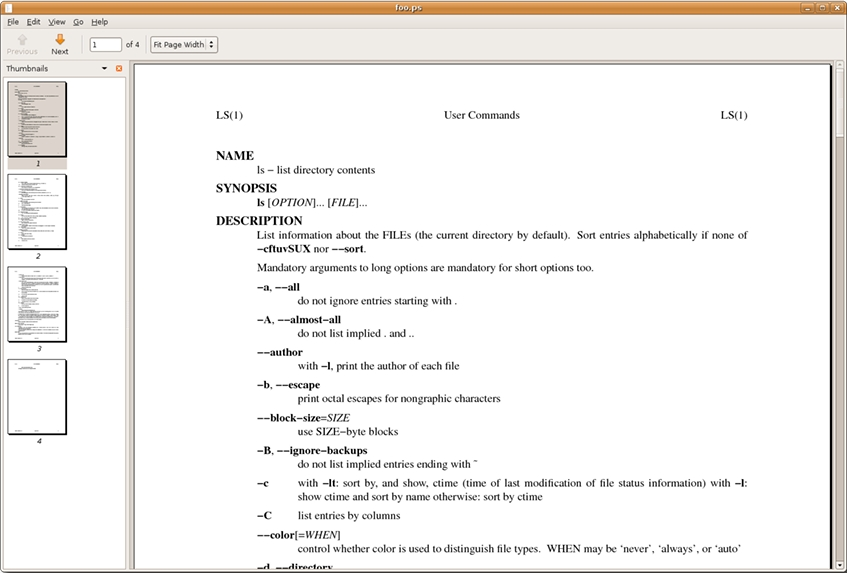
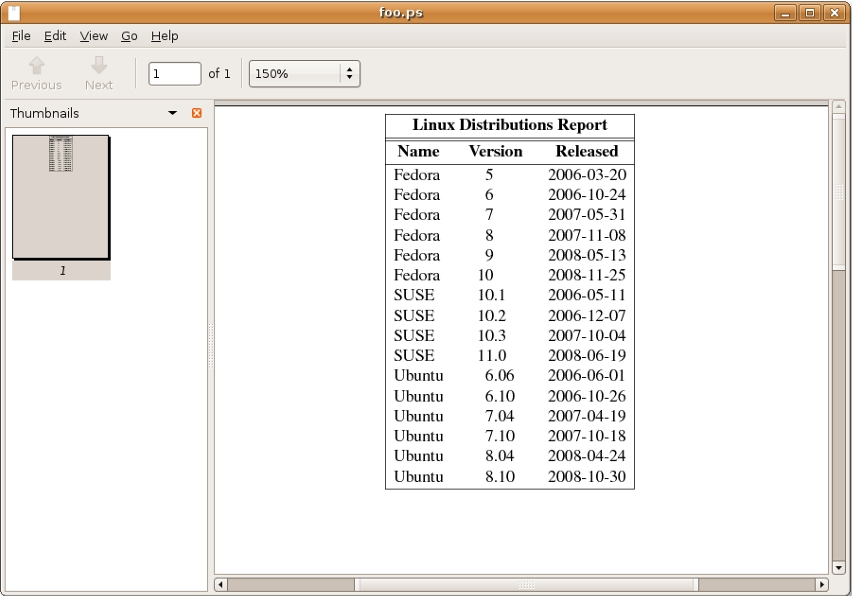

# ۲۱ – قالب‌بندی خروجی*

در این فصل، بررسی ابزارهای مرتبط با متن را ادامه می‌دهیم، با تمرکز بر برنامه‌هایی که برای قالب‌بندی خروجی متن استفاده می‌شوند، نه تغییر خود متن. این ابزارها اغلب برای آماده‌سازی متن جهت چاپ نهایی کاربرد دارند؛ موضوعی که در فصل بعدی آن را پوشش خواهیم داد.
برنامه‌هایی که در این فصل بررسی می‌کنیم شامل موارد زیر هستند:

● **nl** – شماره‌گذاری خطوط
● **fold** – پیچیدن هر خط به طول مشخص
● **fmt** – یک قالب‌بندی‌کنندهٔ سادهٔ متن
● **pr** – آماده‌سازی متن برای چاپ
● **printf** – قالب‌بندی و چاپ داده
● **groff** – یک سیستم قالب‌بندی اسناد

---

### **ابزارهای سادهٔ قالب‌بندی**

ابتدا به برخی از ابزارهای سادهٔ قالب‌بندی نگاه می‌کنیم. این‌ها بیشتر برنامه‌هایی تک‌منظوره هستند و کارهایی که انجام می‌دهند چندان پیچیده نیست؛ اما می‌توان از آن‌ها برای کارهای کوچک و نیز به‌عنوان بخشی از پایپ‌لاین‌ها و اسکریپت‌ها استفاده کرد.

---

## **nl – شماره‌گذاری خطوط**

برنامهٔ **nl** ابزاری نسبتاً قدیمی است که برای انجام یک کار ساده به کار می‌رود: شماره‌گذاری خطوط. در ساده‌ترین استفادهٔ آن، شبیه `cat -n` عمل می‌کند:

```
$ nl distros.txt | head
     1
SUSE
     2
     3
     4
     5
     6
     7
Fedora
SUSE
Ubuntu
Fedora
SUSE
10.2 12/07/2006
10
11/25/2008
11.0 06/19/2008
8.04 04/24/2008
8
11/08/2007
10.3 10/04/2007
Ubuntu
6.10 10/26/2006
```

مثل `cat`، ابزار nl می‌تواند چند فایل را به عنوان آرگومان خط فرمان بپذیرد یا از ورودی استاندارد بخواند. بااین‌حال، nl تعداد زیادی گزینه دارد و از نوعی فرم ابتدایی Markup پشتیبانی می‌کند که انواع پیچیده‌تری از شماره‌گذاری را امکان‌پذیر می‌سازد.

---

### **nl از یک مفهوم به نام “صفحات منطقی” پشتیبانی می‌کند**

nl هنگام شماره‌گذاری از مفهومی به اسم **logical pages** استفاده می‌کند. این امکان را می‌دهد که nl توالی عددگذاری را دوباره از ابتدا شروع کند. با استفاده از گزینه‌ها می‌توان شمارهٔ شروع و تا حد محدودی، فرمت آن را تعیین کرد. یک صفحهٔ منطقی از سه بخش تشکیل می‌شود:

* header
* body
* footer

در هر یک از این بخش‌ها، شماره‌گذاری می‌تواند دوباره تنظیم شود یا سبک متفاوتی داشته باشد. اگر چند فایل به nl داده شود، آن‌ها را به‌عنوان یک جریان واحد متن در نظر می‌گیرد. بخش‌ها در متن با وجود یک سری Markup که شکل نسبتاً عجیبی دارند مشخص می‌شوند:

---

### **جدول 21-1: Markup در nl**

| Markup   | معنی                    |
| -------- | ----------------------- |
| `\:\:\:` | شروع header صفحهٔ منطقی |
| `\:\:`   | شروع body صفحهٔ منطقی   |
| `\:`     | شروع footer صفحهٔ منطقی |

هر یک از این نشانه‌ها باید به‌صورت **تک‌خطی** در خط جداگانه ظاهر شوند. پس از پردازش، nl این نشانه‌ها را از متن حذف می‌کند.

---

### **گزینه‌های رایج nl**

**جدول 21-2: گزینه‌های رایج nl**

**Option – Meaning**

* `-b style`
   تنظیم سبک شماره‌گذاری بدنه، که style یکی از موارد زیر است:
   `a` = شماره‌گذاری همهٔ خطوط
   `t` = شماره‌گذاری فقط خطوط غیر خالی (پیش‌فرض)
   `n` = بدون شماره‌گذاری
   `pregexp` = شماره‌گذاری فقط خطوطی که با یک عبارت منظم (regexp) مطابقت دارند

* `-f style`
   تنظیم سبک شماره‌گذاری در footer. پیش‌فرض: none.

* `-h style`
   تنظیم سبک شماره‌گذاری در header. پیش‌فرض: none.

* `-i number`
   تنظیم مقدار افزایش شماره‌ها. پیش‌فرض: ۱.

* `-n format`
   تنظیم فرمت شماره‌گذاری، که یکی از موارد زیر است:
   `ln` = چپ‌چین بدون صفرهای پیشرو
   `rn` = راست‌چین بدون صفرهای پیشرو (پیش‌فرض)
   `rz` = راست‌چین همراه با صفرهای پیشرو

* `-p`
   شماره‌گذاری را در ابتدای هر صفحهٔ منطقی ریست نکن.

* `-s string`
   افزودن یک رشته به انتهای شمارهٔ هر خط به عنوان جداکننده (پیش‌فرض: یک تب)

* `-v number`
   تنظیم اولین شمارهٔ هر صفحهٔ منطقی. پیش‌فرض: ۱.

* `-w width`
   تنظیم عرض فیلد شماره. پیش‌فرض: ۶.

---

صادقانه بگوییم، احتمالاً خیلی وقت‌ها نیازی به شماره‌گذاری خطوط نداریم، اما می‌توانیم از nl برای ترکیب چند ابزار جهت انجام کارهای پیچیده‌تر استفاده کنیم.
در ادامه بر پایهٔ کار فصل قبل، یک گزارش از توزیع‌های لینوکس تولید می‌کنیم.
از آنجا که می‌خواهیم از nl استفاده کنیم، لازم است markupهای header/body/footer آن را اضافه کنیم. برای این کار، آن‌ها را به اسکریپت sed فصل قبل اضافه می‌کنیم.

اسکریپت را به شکل زیر تغییر می‌دهیم و با نام **distros-nl.sed** ذخیره می‌کنیم:

```
# sed script to produce Linux distributions report
1 i\
\\:\\:\\:\
\
Linux Distributions Report\
\
Name---
\\:\\: 
Ver. Released\ ------------\
$ a\
\\:\
\
End Of Report
s/\([0-9]\{2\}\)\/\([0-9]\{2\}\)\/\([0-9]\{4\}\)$/\3-\1-\2/
```

این اسکریپت اکنون markup صفحهٔ منطقی nl را وارد می‌کند و یک footer در پایان گزارش اضافه می‌کند. توجه کنید که مجبور بودیم بک‌اسلش‌ها را دوبل کنیم، چون sed آن‌ها را به‌صورت escape character تفسیر می‌کند.

---

### حالا گزارش را با ترکیب sort، sed و nl تولید می‌کنیم

```
sort -k 1,1 -k 2n distros.txt | sed -f distros-nl.sed | nl
```

خروجی:

```
Linux Distributions Report

Name     Ver.    Released
----     ----    --------
1   Fedora  5       2006-03-20
2   Fedora  6       2006-10-24
3   Fedora  7       2007-05-31
...
End Of Report
```

---

گزارش ما نتیجهٔ پایپ‌لاین چند دستور است:

1. ابتدا فهرست را بر اساس نام توزیع و نسخه (فیلدهای ۱ و ۲) مرتب می‌کنیم.
2. سپس نتایج با sed پردازش می‌شود تا header و footer (شامل markupهای nl) اضافه شود.
3. در نهایت با nl پردازش می‌شود، که به‌طور پیش‌فرض فقط خطوط بخش body را شماره‌گذاری می‌کند.

---

ما می‌توانیم دستور را تکرار کنیم و با گزینه‌های مختلف nl آزمایش کنیم. برخی گزینه‌های جالب عبارت‌اند از:

```
nl -n rz
```

و

```
nl -w 3 -s ' '
```

---

## **fold – شکستن هر خط به طول مشخص**

"Folding" فرایند شکستن خطوط متن در یک عرض مشخص است. مانند سایر دستورات ما، fold نیز یک یا چند فایل متنی یا ورودی استاندارد را می‌پذیرد. اگر یک جریان ساده متن به fold بدهیم، می‌توانیم ببینیم چگونه عمل می‌کند:

```
$ echo "The quick brown fox jumped over the lazy dog." | fold -w 12
The quick br
own fox jump
ed over the
lazy dog.
```

اینجا fold را در حال کار می‌بینیم. متنی که توسط دستور echo ارسال شده است، مطابق گزینه‌ی `-w` شکسته شده است. در این مثال، ما عرض خط را ۱۲ کاراکتر مشخص می‌کنیم. اگر عرض تعیین نشود، پیش‌فرض ۸۰ کاراکتر است. توجه کنید که خطوط بدون توجه به مرز کلمات شکسته می‌شوند.

افزودن گزینه‌ی `-s` باعث می‌شود fold خط را در آخرین فاصلهٔ موجود قبل از رسیدن به عرض خط بشکند:

```
$ echo "The quick brown fox jumped over the lazy dog." | fold -w 12 -s
The quick
brown fox
jumped over
the lazy
dog.
```

---

## **fmt – یک قالب‌بندی‌کنندهٔ سادهٔ متن**

برنامهٔ **fmt** نیز متن را می‌شکند، ولی کارهای بیشتری هم انجام می‌دهد. این برنامه فایل‌ها یا ورودی استاندارد را می‌پذیرد و روی جریان متن، قالب‌بندی پاراگراف انجام می‌دهد. اساساً خطوط را پر می‌کند و به هم متصل می‌کند، در حالی که خطوط خالی و تورفتگی (indentation) را حفظ می‌کند.

برای نمایش عملکرد آن، نیاز به مقداری متن داریم. مقداری متن از صفحهٔ info مربوط به fmt برمی‌داریم:

```
‘fmt’ reads from the specified FILE arguments (or standard input
if none are given), and writes to standard output.

By default, blank lines, spaces between words, and indentation are
preserved in the output; successive input lines with different
indentation are not joined; tabs are expanded on input and introduced
on output.

‘fmt’ prefers breaking lines at the end of a sentence, and tries
to avoid line breaks after the first word of a sentence or before the
last word of a sentence. A "sentence break" is defined as either the
end of a paragraph or a word ending in any of `.?!', followed by two
spaces or end of line, ignoring any intervening parentheses or
quotes. Like TeX, ‘fmt’ reads entire "paragraphs" before choosing
line breaks; the algorithm is a variant of that given by Donald E.
Knuth and Michael F. Plass in "Breaking Paragraphs Into Lines",
‘Software--Practice & Experience’ 11, 11 (November 1981), 1119–1184.
```

این متن را در ویرایشگر خود کپی می‌کنیم و فایل را با نام **fmt-info.txt** ذخیره می‌کنیم.

حال فرض کنیم بخواهیم این متن را به ستونی با عرض ۵۰ کاراکتر قالب‌بندی کنیم. می‌توانیم این کار را با دستور fmt و گزینه‌ی `-w` انجام دهیم:

```
$ fmt -w 50 fmt-info.txt | head
   ‘fmt’ reads from the specified FILE arguments
   (or standard input if
none are given), and writes to standard output.
   By default, blank lines, spaces between words,
   and indentation are
preserved in the output; successive input lines
with different indentation are not joined; tabs
are expanded on input and introduced on output.
```

خب، این نتیجه کمی نامناسب است. شاید باید واقعاً این متن را بخوانیم، چون توضیح می‌دهد چه اتفاقی در حال رخ دادن است:

«به‌صورت پیش‌فرض، خطوط خالی، فاصله‌های بین کلمات، و تورفتگی در خروجی حفظ می‌شوند؛ خطوط ورودی متوالی با تورفتگی متفاوت، با هم ترکیب نمی‌شوند؛ تب‌ها هنگام ورودی گسترش یافته و هنگام خروجی اضافه می‌شوند.»

پس fmt تورفتگی خط اول را حفظ می‌کند. خوشبختانه fmt گزینه‌ای برای اصلاح این رفتار ارائه می‌دهد:

```
fmt -cw 50 fmt-info.txt
```

خروجی:

```
   ‘fmt’ reads from the specified FILE arguments (or standard input if none are given), and writes to standard output.

   By default, blank lines, spaces between words, and indentation are preserved in the output; successive input lines with different indentation are not joined; tabs are expanded on input and introduced on output.

   ‘fmt’ prefers breaking lines at the end of a sentence, and tries to avoid line breaks after the first word of a sentence or before the last word of a sentence. A "sentence break" is defined as either the end of a paragraph or a word ending in any of `.?!', followed by two spaces or end of line, ignoring any intervening parentheses or quotes. Like TeX, ‘fmt’ reads entire "paragraphs" before choosing line breaks; the algorithm is a variant of that given by Donald E. Knuth and Michael F. Plass in "Breaking Paragraphs Into Lines", ‘Software--Practice & Experience’ 11, 11 (November 1981), 1119–1184.
```

خیلی بهتر شد. با افزودن گزینه‌ی **-c**، اکنون نتیجهٔ موردنظر را به دست آورده‌ایم.

---

fmt چند گزینهٔ جالب دارد:

### **جدول 21-3: گزینه‌های fmt**

**Option — Description**

* **-c**
  در حالت *حاشیهٔ تاجی* (crown margin) کار می‌کند. این حالت تورفتگی دو خط اول یک پاراگراف را حفظ می‌کند. خطوط بعدی با تورفتگی خط دوم هم‌تراز می‌شوند.

* **-p string**
  فقط آن خطوطی را قالب‌بندی می‌کند که با رشتهٔ *string* شروع می‌شوند. بعد از قالب‌بندی، محتوای string به ابتدای هر خط قالب‌بندی‌شده اضافه می‌شود.
  این گزینه می‌تواند برای قالب‌بندی متن در کامنت‌های کد منبع استفاده شود. برای مثال، هر زبان برنامه‌نویسی یا فایل پیکربندی که از کاراکتر «#» برای مشخص‌کردن کامنت استفاده می‌کند، می‌تواند با مشخص‌کردن گزینهٔ `-p '# '` قالب‌بندی شود تا فقط کامنت‌ها قالب‌بندی شوند. مثال زیر را ببینید.

* **-s**
  حالت فقط-شکستن (split-only). در این حالت، خطوط فقط برای منطبق‌ شدن با عرض ستون مشخص‌شده شکسته می‌شوند. خطوط کوتاه‌تر برای پرکردن خطوط به هم متصل (join) نمی‌شوند. این حالت هنگام قالب‌بندی متونی مثل کد که در آن اتصال خطوط مطلوب نیست مفید است.

* **-u**
  انجام *فاصله‌گذاری یکنواخت*. این حالت قالب‌بندی سنتی «ماشین تحریر» را اعمال می‌کند. یعنی یک فاصله بین کلمات و دو فاصله بین جملات. این حالت برای حذف «justification»، یعنی متنی که با فاصله اضافی برای هم‌تراز شدن با حاشیه چپ و راست پُر شده، مفید است.

* **-w width**
  قالب‌بندی متن به گونه‌ای که در ستونی با عرض *width* کاراکتر قرار گیرد. مقدار پیش‌فرض ۷۵ کاراکتر است.
  نکته: fmt خطوط را کمی کوتاه‌تر از عرض مشخص‌شده قالب‌بندی می‌کند تا امکان بالانس خطوط فراهم شود.

---

گزینهٔ **-p** به‌ویژه جالب است. با استفاده از آن، می‌توانیم بخش‌های انتخابی یک فایل را قالب‌بندی کنیم، به شرطی که خطوط موردنظر همگی با یک توالی مشخص از کاراکترها شروع شوند. بسیاری از زبان‌های برنامه‌نویسی از علامت `#` برای شروع کامنت استفاده می‌کنند و بنابراین می‌توانند با این گزینه قالب‌بندی شوند.

بیایید فایلی بسازیم که برنامه‌ای با کامنت‌ها را شبیه‌سازی می‌کند:

```
$ cat > fmt-code.txt
# This file contains code with comments.
# This line is a comment.
# Followed by another comment line.
# And another.
This, on the other hand, is a line of code.
And another line of code.
And another.
```

فایل نمونهٔ ما شامل کامنت‌هایی است که با رشتهٔ «# » (هش و سپس فاصله) شروع می‌شوند و خطوطی از «کد» که این‌گونه نیستند.

حال، با استفاده از fmt می‌توانیم کامنت‌ها را قالب‌بندی کنیم و کد را دست‌نخورده باقی بگذاریم:

```
$ fmt -w 50 -p '# ' fmt-code.txt
# This file contains code with comments.
# This line is a comment. Followed by another
# comment line. And another.
This, on the other hand, is a line of code.
And another line of code.
And another.
```

توجه کنید که خطوط کامنتی کنار هم به یکدیگر متصل شده‌اند، در حالی که خطوط خالی و خط‌های غیرکامنت حفظ شده‌اند.

---

## **pr – قالب‌بندی متن برای چاپ**

برنامهٔ **pr** برای صفحه‌بندی متن (paginate) استفاده می‌شود. هنگام چاپ متن، اغلب لازم است صفحات خروجی با چند خط فاصلهٔ خالی از هم جدا شوند تا برای هر صفحه حاشیهٔ بالا و پایین ایجاد شود. همچنین این فضای خالی می‌تواند برای گذاشتن header و footer در هر صفحه استفاده شود.

با استفاده از pr فایل **distros.txt** را به مجموعه‌ای از صفحات بسیار کوتاه قالب‌بندی می‌کنیم (فقط دو صفحهٔ اول نشان داده شده):

```
$ pr -l 15 -w 65 distros.txt
2008-12-11 18:27                distros.txt                Page 1
SUSE 10.2 12/07/2006
Fedora 10 11/25/2008
SUSE 11.0 06/19/2008
Ubuntu 8.04 04/24/2008
Fedora 8 11/08/2007

2008-12-11 18:27                distros.txt                Page 2
SUSE 10.3 10/04/2007
Ubuntu 6.10 10/26/2006
Fedora 7 05/31/2007
Ubuntu 7.10 10/18/2007
Ubuntu 7.04 04/19/2007
```

در این مثال، از گزینهٔ **-l** (طول صفحه) و **-w** (عرض صفحه) استفاده کرده‌ایم تا یک «صفحه» با عرض ۶۵ ستون و طول ۱۵ خط تعریف کنیم.
pr محتوای فایل distros.txt را صفحه‌بندی می‌کند، هر صفحه را با چند خط فضای خالی جدا می‌کند، و یک header پیش‌فرض حاوی زمان آخرین تغییر فایل، نام فایل و شمارهٔ صفحه ایجاد می‌کند.

برنامهٔ pr گزینه‌های بسیاری برای کنترل چیدمان صفحه ارائه می‌دهد. برخی از آن‌ها را در فصل بعد بررسی خواهیم کرد.

---

### **printf – قالب‌بندی و چاپ داده**

برخلاف سایر دستورات این فصل، دستور **printf** برای پایپ‌لاین‌ها استفاده نمی‌شود (ورودی استاندارد را نمی‌پذیرد) و همچنین معمولاً به‌صورت مستقیم روی خط فرمان استفادهٔ زیادی ندارد (اغلب در اسکریپت‌ها استفاده می‌شود).
پس چرا مهم است؟
چون بسیار پرکاربرد است.

printf (مخفف عبارت “print formatted”) در اصل برای زبان برنامه‌نویسی C توسعه داده شد و در بسیاری از زبان‌های برنامه‌نویسی از جمله شِل پیاده‌سازی شده است. در واقع، در bash، printf یک دستور داخلی (builtin) است.

printf به این صورت کار می‌کند:

```
printf "format" arguments
```

این دستور یک رشته دریافت می‌کند که شامل توضیحات قالب‌بندی است و آن را روی فهرستی از آرگومان‌ها اعمال می‌کند. خروجی قالب‌بندی‌شده به خروجی استاندارد ارسال می‌شود. این یک مثال ساده است:

```
$ printf "I formatted the string: %s\n" foo
I formatted the string: foo
```

رشتهٔ قالب‌بندی می‌تواند شامل متن literal (مثل: “I formatted the string:”)، توالی‌های escape (مانند `\n`، که کاراکتر newline است)، و توالی‌هایی که با `%` شروع می‌شوند باشد که به آن‌ها **مشخصات تبدیل** (conversion specifications) گفته می‌شود.

در مثال بالا، مشخصهٔ تبدیل `%s` برای قالب‌بندی رشتهٔ “foo” و قرار دادن آن در خروجی دستور استفاده شده است. مثال:

```
$ printf "I formatted '%s' as a string.\n" foo
I formatted 'foo' as a string.
```

همان‌طور که می‌بینیم، مشخصهٔ `%s` با رشتهٔ “foo” در خروجی جایگزین می‌شود. تبدیل **s** برای قالب‌بندی دادهٔ رشته‌ای استفاده می‌شود. مشخصه‌های دیگری برای انواع دیگر داده‌ها وجود دارند.

---

## **جدول 21-4: مشخصه‌های پرکاربرد داده در printf**

| Specifier | Description                                                |
| --------- | ---------------------------------------------------------- |
| **d**     | قالب‌بندی یک عدد به‌صورت عدد صحیح ده‌دهی signed            |
| **f**     | قالب‌بندی و چاپ یک عدد اعشاری (floating point)             |
| **o**     | قالب‌بندی یک عدد صحیح به‌صورت عدد octal                    |
| **s**     | قالب‌بندی یک رشته                                          |
| **x**     | قالب‌بندی یک عدد صحیح به‌صورت hexadecimal با حروف کوچک a–f |
| **X**     | همان x اما با حروف بزرگ                                    |
| **%**     | چاپ یک علامت % literal (یعنی باید “%%” نوشت)               |

حالا اثر هر مشخصه را روی رشتهٔ “380” نمایش می‌دهیم:

```
$ printf "%d, %f, %o, %s, %x, %X\n" 380 380 380 380 380 380
380, 380.000000, 574, 380, 17c, 17C
```

چون شش مشخصهٔ تبدیل مشخص شده‌اند، باید شش آرگومان نیز به printf بدهیم. شش خروجی نشان‌دهندهٔ اثر هر مشخصه هستند.

---

## یک مشخصهٔ تبدیل کامل می‌تواند شامل موارد زیر باشد

```
%[flags][width][.precision]conversion_specification
```

وقتی چند بخش اختیاری استفاده می‌شوند، باید دقیقاً به همین ترتیب قرار بگیرند.

### **جدول 21-5: اجزای مشخصهٔ تبدیل در printf**

#### **Component — Description**

**flags**
پنج فلگ وجود دارد:

* **#**
  استفاده از «قالب جایگزین». بسته به نوع داده متفاوت است:

  * در تبدیل o، خروجی با `0` پیشوند می‌گیرد
  * در تبدیل‌های x و X، خروجی با `0x` یا `0X` پیشوند می‌گیرد

* **0**
  پُرکردن خروجی با صفرهای پیشرو. یعنی فیلد با صفر پر می‌شود، مثل `"000380"`.

* **-**
  چپ‌چین کردن خروجی. به‌طور پیش‌فرض printf خروجی را راست‌چین می‌کند.

* **(space)**
  افزودن یک فاصلهٔ پیشرو برای اعداد مثبت.

* **+**
  علامت‌گذاری اعداد مثبت. به‌طور پیش‌فرض فقط اعداد منفی نشانه‌گذاری می‌شوند.

---

**width**
یک عدد که حداقل عرض فیلد را مشخص می‌کند.

**.precision**

* برای اعداد اعشاری: تعداد ارقام بعد از نقطه
* برای رشته‌ها: تعداد کاراکترهایی که باید چاپ شوند

---

## **جدول 21-6: مثال‌هایی از مشخصه‌های قالب‌بندی printf**

| Argument    | Format    | Result      | Notes                                                                        |
| ----------- | --------- | ----------- | ---------------------------------------------------------------------------- |
| 380         | `%d`      | 380         | قالب‌بندی سادهٔ یک عدد صحیح                                                  |
| 380         | `%#x`     | 0x17c       | عدد صحیح به‌صورت hexadecimal با قالب جایگزین                                 |
| 380         | `%05d`    | 00380       | عدد با صفرهای پیشرو و عرض حداقل ۵                                            |
| 380         | `%05.5f`  | 380.00000   | عدد اعشاری با padding و دقت ۵ — padding تأثیری ندارد چون عرض واقعی بیشتر است |
| 380         | `%010.5f` | 0380.00000  | با افزایش عرض فیلد به ۱۰، padding قابل مشاهده می‌شود                         |
| 380         | `%+d`     | +380        | علامت‌گذاری اعداد مثبت با فلگ +                                              |
| 380         | `%-d`     | 380         | چپ‌چین کردن با فلگ -                                                         |
| abcdefghijk | `%5s`     | abcdefghijk | رشته با حداقل عرض فیلد                                                       |
| abcdefghijk | `%.5s`    | abcde       | با تعیین precision رشته کوتاه می‌شود                                         |

---

بار دیگر، printf بیشتر در اسکریپت‌ها استفاده می‌شود، جایی که برای قالب‌بندی داده‌های جدولی به کار می‌رود، و نه به‌طور مستقیم روی خط فرمان. اما همچنان می‌توانیم نشان دهیم که چگونه می‌توان از آن برای حل مشکلات مختلف قالب‌بندی استفاده کرد.

ابتدا، بیایید چند فیلد را که با کاراکتر تب از هم جدا شده‌اند خروجی بگیریم:

```
$ printf "%s\t%s\t%s\n" str1 str2 str3
str1    str2    str3
```

با قرار دادن `\t` (توالی escape برای تب)، به نتیجهٔ دلخواه می‌رسیم.
در مرحلهٔ بعد، چند عدد با قالب‌بندی تمیز:

```
$ printf "Line: %05d %15.3f Result: %+15d\n" 1071 3.14156295 32589
Line: 01071           3.142 Result:          +32589
```

این نشان می‌دهد که حداقل عرض فیلد چه تأثیری بر فاصلهٔ بین فیلدها دارد.
یا مثلاً قالب‌بندی یک صفحهٔ کوچک وب:

```
$ printf "<html>\n\t<head>\n\t\t<title>%s</title>\n\t</head>\n\t<body>\n\t\t<p>%s</p>\n\t</body>\n</html>\n" "Page Title" "Page Content"
<html>
<head>
<title>Page Title</title>
</head>
<body>
<p>Page Content</p>
</body>
</html>
```

---

## **سیستم‌های قالب‌بندی اسناد**

تا اینجا، ابزارهای سادهٔ قالب‌بندی متن را بررسی کردیم. این ابزارها برای کارهای کوچک و ساده خوب هستند، اما برای کارهای بزرگ‌تر چه؟

یکی از دلایلی که یونیکس در میان کاربران فنی و علمی محبوب شد (علاوه بر فراهم‌کردن یک محیط چندکاره و چندکاربرهٔ قدرتمند برای انواع توسعهٔ نرم‌افزار) این بود که ابزارهایی ارائه می‌داد که می‌توانستند انواع مختلف اسناد، به‌ویژه انتشارات علمی و دانشگاهی را تولید کنند. در واقع، همان‌طور که مستندات GNU توضیح می‌دهد، **آماده‌سازی اسناد نقش مهمی در توسعهٔ یونیکس داشته است**:

«اولین نسخهٔ یونیکس روی یک PDP-7 که در آزمایشگاه بل بلااستفاده مانده بود، توسعه پیدا کرد. در سال ۱۹۷۱، توسعه‌دهندگان می‌خواستند یک PDP-11 برای ادامه کار روی سیستم عامل تهیه کنند. برای توجیه هزینهٔ این سیستم، پیشنهاد دادند که یک سیستم قالب‌بندی اسناد برای بخش ثبت اختراعات AT&T پیاده‌سازی کنند. این برنامهٔ قالب‌بندی نخست، پیاده‌سازی مجددی از roff مَک‌ایلروی بود که توسط J. F. Ossanna نوشته شد.»

دو خانوادهٔ اصلی از قالب‌بندی‌کننده‌های اسناد بر این حوزه مسلط‌اند:

1. آن‌هایی که از برنامهٔ اصلی **roff** مشتق شده‌اند، از جمله **nroff** و **troff**
2. آن‌هایی که بر اساس سیستم حروف‌چینی **TEX** اثر دونالد کنوت ساخته شده‌اند (که تلفظ آن "tek" است). و بله، «E» حذف‌شده در وسط، بخشی از نام آن است.

نام «roff» از عبارت “run off” گرفته شده است؛ به معنای «یک نسخه برات می‌زنم».
برنامهٔ **nroff** برای قالب‌بندی اسناد جهت خروجی به دستگاه‌هایی استفاده می‌شود که از فونت‌های تک‌عرض (monospaced) استفاده می‌کنند، مانند ترمینال‌های کاراکتری و چاپگرهای شبیه ماشین‌تحریر. در زمان معرفی nroff، تقریباً همهٔ دستگاه‌های چاپ متصل به کامپیوتر چنین بودند.

برنامهٔ **troff** که بعداً معرفی شد، اسناد را برای خروجی روی دستگاه‌های typesetter قالب‌بندی می‌کند؛ دستگاه‌هایی که خروجی «مناسب چاپخانه» تولید می‌کنند. اغلب چاپگرهای امروزی می‌توانند خروجی typesetter را شبیه‌سازی کنند. خانوادهٔ roff همچنین شامل برنامه‌های دیگری است که برای آماده‌سازی بخش‌هایی از اسناد استفاده می‌شوند، مانند:

* **eqn** (برای معادلات ریاضی)
* **tbl** (برای جدول‌ها)

سیستم **TEX** (در نسخهٔ پایدار خود) نخستین بار در سال ۱۹۸۹ ظاهر شد و تا حدی troff را به‌عنوان ابزار اصلی خروجی typesetter کنار زده است. ما TEX را در اینجا پوشش نمی‌دهیم، هم به دلیل پیچیدگی آن (کتاب‌های کامل دربارهٔ آن نوشته شده) و هم به این دلیل که روی بسیاری از سیستم‌های مدرن لینوکس به‌صورت پیش‌فرض نصب نیست.

**نکته:**
برای کسانی که علاقه‌مند به نصب TEX هستند، بستهٔ **texlive** را بررسی کنند که در اغلب مخازن توزیع‌ها موجود است، و همچنین ویرایشگر گرافیکی محتوای **LyX** را.

---

### **groff**

**groff** مجموعه‌ای از برنامه‌ها است که شامل پیاده‌سازی GNU از **troff** می‌باشد. این مجموعه همچنین اسکریپتی را شامل می‌شود که برای شبیه‌سازی **nroff** و دیگر اعضای خانوادهٔ **roff** استفاده می‌شود.

در حالی که roff و فرزندانش برای ساخت اسناد قالب‌بندی‌شده استفاده می‌شوند، این کار را به روشی انجام می‌دهند که برای کاربران امروزی کمی ناآشناست.
امروزه بیشتر اسناد با استفاده از واژه‌پردازهایی تولید می‌شوند که قادرند هم **ترکیب متن** و هم **طرح‌بندی** را در یک مرحله انجام دهند.

پیش از ظهور واژه‌پرداز گرافیکی، اسناد اغلب طی یک فرایند دو مرحله‌ای تولید می‌شدند که شامل:

1. استفاده از یک ویرایشگر متن برای انجام ترکیب (composition)،
2. و استفاده از پردازنده‌ای مانند troff برای اعمال قالب‌بندی

بود. دستورالعمل‌های برنامهٔ قالب‌بندی از طریق یک **زبان markup** درون متن ترکیب‌شده قرار می‌گرفت.
نمونهٔ مدرن چنین فرایندی **صفحهٔ وب** است که با یک ویرایشگر متن ساخته می‌شود و سپس توسط مرورگر وب، با استفاده از HTML به‌عنوان زبان markup برای توضیح چیدمان نهایی صفحه، رندر می‌شود.

ما قصد نداریم تمام groff را پوشش دهیم، زیرا بسیاری از اجزای زبان markup آن با جزئیات پیچیدهٔ تایپوگرافی سروکار دارند. در عوض، روی یکی از **بسته‌های ماکرو** آن که همچنان به‌طور گسترده استفاده می‌شود تمرکز می‌کنیم.
این بسته‌های ماکرو بسیاری از دستورات سطح پایین را به مجموعهٔ کوچک‌تری از دستورات سطح بالا تبدیل می‌کنند، که استفاده از groff را بسیار آسان‌تر می‌سازد.

برای لحظه‌ای، صفحهٔ سادهٔ **man** را در نظر بگیریم. این صفحه در مسیر `/usr/share/man` به‌صورت یک فایل متنی فشرده‌شده با gzip قرار دارد. اگر محتوای غیر فشردهٔ آن را بررسی کنیم، چنین چیزی خواهیم دید (صفحهٔ man مربوط به ls در بخش ۱):

```
$ zcat /usr/share/man/man1/ls.1.gz | head
.\" DO NOT MODIFY THIS FILE!  It was generated by help2man 1.35.
.TH LS "1" "April 2008" "GNU coreutils 6.10" "User Commands"
.SH NAME
ls \- list directory contents
.SH SYNOPSIS
.B ls
[\fIOPTION\fR]... [\fIFILE\fR]...
.SH DESCRIPTION
.\" Add any additional description here
.PP
```

در مقایسه با صفحهٔ man در حالت نمایش معمولی، می‌توانیم شروع به دیدن ارتباط میان زبان markup و نتیجهٔ آن کنیم:

```
$ man ls | head
LS(1)                     User Commands                      LS(1)
       ls - list directory contents

SYNOPSIS
       ls [OPTION]... [FILE]...
```

دلیل اینکه این موضوع مهم است این است که صفحات man توسط **groff** و با استفاده از **macro package مربوط به mandoc** رندر می‌شوند.
در واقع، می‌توانیم دستور man را با این پایپ‌لاین شبیه‌سازی کنیم:

```
$ zcat /usr/share/man/man1/ls.1.gz | groff -mandoc -T ascii | head
LS(1)                     User Commands                      LS(1)
NAME
       ls - list directory contents
SYNOPSIS
       ls [OPTION]... [FILE]...
```

در اینجا ما از برنامهٔ groff با گزینه‌هایی استفاده می‌کنیم که macro package مربوط به **mandoc** و driver خروجی برای **ASCII** را مشخص می‌کنند.
groff می‌تواند خروجی را در چندین فرمت تولید کند. اگر هیچ فرمتی مشخص نشود، به‌صورت پیش‌فرض **PostScript** خروجی داده می‌شود:

```
$ zcat /usr/share/man/man1/ls.1.gz | groff -mandoc | head
%!PS-Adobe-3.0
%%Creator: groff version 1.18.1
%%CreationDate: Thu Feb  5 13:44:37 2009
%%DocumentNeededResources: font Times-Roman
%%+ font Times-Bold
%%+ font Times-Italic
%%DocumentSuppliedResources: procset grops 1.18 1
%%Pages: 4
%%PageOrder: Ascend
%%Orientation: Portrait
```

در فصل قبلی مختصراً به PostScript اشاره کردیم و در فصل بعد نیز دوباره به آن خواهیم پرداخت.
PostScript یک **زبان توصیف صفحه** است که برای توصیف محتوای یک صفحهٔ چاپ‌شده به یک دستگاه شبیه typesetter استفاده می‌شود.

اگر خروجی دستور بالا را در یک فایل ذخیره کنیم (فرض بر این است که از محیط دسکتاپ گرافیکی با دایرکتوری Desktop استفاده می‌کنیم):

```
zcat /usr/share/man/man1/ls.1.gz | groff -mandoc > ~/Desktop/foo.ps
```

یک آیکون برای فایل خروجی باید روی دسکتاپ ظاهر شود. با دوبار کلیک‌کردن روی آن آیکون، یک نمایشگر صفحه (page viewer) باید اجرا شود و فایل را در حالت رندرشده نمایش دهد.

 <div align="center">


</div>
شکل ۴: مشاهده خروجی PostScript با یک نمایشگر صفحات در GNOME

آنچه می‌بینیم یک صفحهٔ man زیبا و حروف‌چینی‌شده برای ls است!
در واقع، امکان تبدیل فایل PostScript به یک فایل PDF (Portable Document Format) با این دستور وجود دارد:

```
ps2pdf ~/Desktop/foo.ps ~/Desktop/ls.pdf
```

برنامهٔ ps2pdf بخشی از بستهٔ **ghostscript** است، که روی اکثر سیستم‌های لینوکسی که از چاپ پشتیبانی می‌کنند نصب شده است.

**Tip:** سیستم‌های لینوکس اغلب شامل برنامه‌های خط فرمان زیادی برای تبدیل قالب فایل‌ها هستند.
این برنامه‌ها معمولاً براساس الگوی **format2format** نام‌گذاری می‌شوند.
دستور زیر را امتحان کنید:

```
ls /usr/bin/*[[:alpha:]]2[[:alpha:]]*
```

تا آن‌ها را شناسایی کنید. همچنین جستجو برای برنامه‌هایی با نام **formattoformat** را امتحان کنید.

---

برای آخرین تمرین خود با groff، یک بار دیگر به فایل قدیمی‌مان **distros.txt** برمی‌گردیم.
این بار از برنامهٔ **tbl** استفاده خواهیم کرد که برای قالب‌بندی جدول‌ها و حروف‌چینی فهرست توزیع‌های لینوکس ما به کار می‌رود. برای انجام این کار، قصد داریم از اسکریپت sed قبلی خود استفاده کنیم تا markup لازم را به جریان متن اضافه کنیم و سپس آن را به groff بفرستیم.

ابتدا لازم است اسکریپت sed خود را تغییر دهیم تا درخواست‌هایی را که tbl نیاز دارد اضافه کنیم. با استفاده از یک ویرایشگر متن، فایل distros.sed را به شکل زیر تغییر می‌دهیم:

```
# sed script to produce Linux distributions report
1 i\
.TS\
center box;\
cb s s\
cb cb cb\
l n c.\
Linux Distributions Report\
=\
Name    Version    Released\
_ 
$ a\
.TE
s/\([0-9]\{2\}\)\/\([0-9]\{2\}\)\/\([0-9]\{4\}\)$/\3-\1-\2/
```

توجه کنید که برای کارکرد صحیح اسکریپت، باید دقت شود که کلمات **"Name Version Released"** با **tab** از هم جدا شده باشند، نه با فاصله.
فایل حاصل را با نام **distros-tbl.sed** ذخیره می‌کنیم.

`tbl` از درخواست‌های `.TS` و `.TE` برای آغاز و پایان جدول استفاده می‌کند. ردیف‌هایی که پس از `.TS` می‌آیند، ویژگی‌های کلی جدول را تعریف می‌کنند که برای مثال ما، جدول در مرکز افقی صفحه قرار می‌گیرد و با یک کادر احاطه می‌شود. خطوط باقی‌مانده، چیدمان هر ردیف جدول را توصیف می‌کنند.

حال اگر پایپ‌لاین تولید گزارش خود را با اسکریپت جدید sed اجرا کنیم، نتیجهٔ زیر را دریافت می‌کنیم:

```
$ sort -k 1,1 -k 2n distros.txt | sed -f distros-tbl.sed | groff -t -T ascii 2>/dev/null
                 +------------------------------+
                 |
Linux Distributions Report
                 |
                 +------------------------------+
                 |
Name    Version    Released  |
                 +------------------------------+
                 |Fedora     5       2006-03-20 |
                 |Fedora     6       2006-10-24 |
                 |Fedora     7       2007-05-31 |
                 |Fedora     8       2007-11-08 |
                 |Fedora     9       2008-05-13 |
                 |Fedora    10       2008-11-25 |
                 |SUSE      10.1     2006-05-11 |
                 |SUSE      10.2     2006-12-07 |
                 |SUSE      10.3     2007-10-04 |
                 |SUSE      11.0     2008-06-19 |
                 |Ubuntu     6.06    2006-06-01 |
                 |Ubuntu     6.10    2006-10-26 |
                 |Ubuntu     7.04    2007-04-19 |
                 |Ubuntu     7.10    2007-10-18 |
                 |Ubuntu     8.04    2008-04-24 |
                 |Ubuntu     8.10    2008-10-30 |
                 +------------------------------+
```

افزودن گزینهٔ **-t** به groff به آن دستور می‌دهد که جریان متن را با **tbl** پیش‌پردازش کند.
همچنین گزینهٔ **-T** برای خروجی به **ASCII** به‌جای محیط خروجی پیش‌فرض (PostScript) استفاده می‌شود.

فرمت خروجی، بهترین چیزی است که می‌توانیم انتظار داشته باشیم اگر به قابلیت‌های صفحه‌نمایش ترمینالی یا چاپگرهای شبیه ماشین‌تحریر محدود باشیم.

اگر خروجی PostScript را مشخص کنیم و نتیجه را به‌صورت گرافیکی مشاهده کنیم، نتیجه بسیار رضایت‌بخش‌تر خواهد بود:

```
sort -k 1,1 -k 2n distros.txt | sed -f distros-tbl.sed | groff -t > ~/Desktop/foo.ps
```

 <div align="center">


</div>
شکل ۵: مشاهده جدول تکمیل‌شده

---

## **Summing Up — جمع‌بندی**

با توجه به اینکه متن تا این اندازه برای ماهیت سیستم‌های عامل شبه‌یونیکس مرکزی است، منطقی است که ابزارهای فراوانی برای دست‌کاری و قالب‌بندی متن وجود داشته باشد. و همان‌طور که دیدیم، همین‌طور هم هست!
ابزارهای سادهٔ قالب‌بندی مانند **fmt** و **pr** کاربردهای زیادی در اسکریپت‌هایی دارند که اسناد کوتاه تولید می‌کنند، در حالی که **groff** (و ابزارهای مرتبط با آن) می‌توانند برای نوشتن کتاب‌ها استفاده شوند.

ممکن است هرگز یک مقالهٔ فنی را با ابزارهای خط فرمان ننویسیم (هرچند بسیاری از افراد این کار را انجام می‌دهند!)، اما خوب است بدانیم که **می‌توانیم**.

---

## **Further Reading — مطالعهٔ بیشتر**

● **groff User’s Guide**
[http://www.gnu.org/software/groff/manual/](http://www.gnu.org/software/groff/manual/)

● **Writing Papers With nroff Using -me:**
[http://docs.freebsd.org/44doc/usd/19.memacros/paper.pdf](http://docs.freebsd.org/44doc/usd/19.memacros/paper.pdf)

● **-me Reference Manual:**
[http://docs.freebsd.org/44doc/usd/20.meref/paper.pdf](http://docs.freebsd.org/44doc/usd/20.meref/paper.pdf)

● **Tbl – A Program To Format Tables:**
[http://plan9.bell-labs.com/10thEdMan/tbl.pdf](http://plan9.bell-labs.com/10thEdMan/tbl.pdf)

● و البته، مقالات زیر در ویکی‌پدیا را هم امتحان کنید:
[http://en.wikipedia.org/wiki/TeX](http://en.wikipedia.org/wiki/TeX)
[http://en.wikipedia.org/wiki/Donald_Knuth](http://en.wikipedia.org/wiki/Donald_Knuth)
[http://en.wikipedia.org/wiki/Typesetting](http://en.wikipedia.org/wiki/Typesetting)
