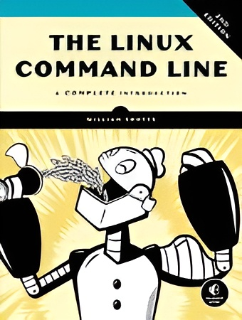

  
  

  

    
# ترجمه فارسی کتاب The Linux Command Line (TLCL)
  برای علاقه‌مندان به لینوکس و ابزارهای خط فرمان (CLI)
  
  

  
  
  
  

<h1>

   <a href="https://hheydarian.github.io/Gitab/" target="_blank"><strong>  گیتاب —  نسخه آنلاین کتاب </strong></a>

 </h1>

---

## ✨ معرفی پروژه  

کتاب **The Linux Command Line** نوشته **William Shotts**  یکی از بهترین منابع برای یادگیری دستورات لینوکس و کار حرفه‌ای با خط فرمان است.  
این پروژه با هدف ارائه ترجمه‌ای فارسی، روان و دقیق برای جامعه لینوکسی و برنامه‌نویسان فارسی‌زبان ایجاد شده است.  

---

## ⚙️ پیش‌نیاز مطالعه  

- آشنایی مقدماتی با **سیستم‌عامل لینوکس**  
- دسترسی به یک توزیع لینوکس (Ubuntu, Debian, Fedora, Arch و ...)  
- علاقه به یادگیری و کار با **ترمینال**  
- برای تجربه خوانایی بهتر در مرورگر، توصیه می‌کنیم افزونه [فونت ایران](https://chromewebstore.google.com/detail/fontiran/edbchgkbejkdkdkpgenlaciegoidmjoh) رو نصب کنید.

---

  
## 📚 وضعیت ترجمه  

| شماره | فصل (انگلیسی)                          | فصل (فارسی)                     | وضعیت | لینک |
|-------|-----------------------------------------|----------------------------------|--------|------|
| 00    | Introduction                           | مقدمه                            | ✅     | [Introduction](Book/00/introduction.md) |
| 01    | What is the Shell?                     | شل چیست؟                        | ✅     | [Chapter-01](Book/01/chapter01.md) |
| 02    | Navigation                             | مسیریابی                         | ✅     | [Chapter-02](Book/02/chapter02.md) |
| 03    | Exploring the System                   | کاوش در سیستم                    | ✅     | [Chapter-03](Book/03/chapter03.md) |
| 04    | Manipulating Files                     | کار با فایل‌ها                   | ✅     | [Chapter-04](Book/04/chapter04.md) |
| 05    | Working with Commands                  | کار با دستورات                   | ✅     | [Chapter-05](Book/05/chapter05.md) |
| 06    | Redirection                            | تغییر مسیر ورودی/خروجی           | ✅     | [Chapter-06](Book/06/chapter06.md) |
| 07    | Seeing the World as the Shell Sees It  | درک جهان به سبک شل               | ✅     | [Chapter-07](Book/07/chapter07.md) |
| 08    | Advanced Keyboard Tricks               | ترفندهای پیشرفته کیبورد          | ✅     | [Chapter-08](Book/08/chapter08.md) |
| 09    | Permissions                            | مجوزها                            | ✅     | [Chapter-09](Book/09/chapter09.md) |
| 10    | Processes                              | پردازه‌ها                         | ✅     | [Chapter-10](Book/10/chapter10.md) |
| 11    | The Environment                        | محیط کاربری (Environment)        | ✅     | [Chapter-11](Book/11/chapter11.md) |
| 12    | A Gentle Introduction to vi            | مقدمه‌ای بر vi                   | ✅     | [Chapter-12](Book/12/chapter12.md) |
| 13    | Customizing the Prompt                 | شخصی‌سازی Prompt                  | ✅     | [Chapter-13](Book/13/chapter13.md) |
| 14    | Package Management                     | مدیریت بسته‌ها                   | ✅     | [Chapter-14](Book/14/chapter14.md) |
| 15    | Storage Media                          | رسانه‌های ذخیره‌سازی             | ✅     | [Chapter-15](Book/15/chapter15.md) |
| 16    | Networking                             | شبکه‌سازی                         | ✅     | [Chapter-16](Book/16/chapter16.md) |
| 17    | Searching for Files                    | جستجوی فایل‌ها                   | ✅     | [Chapter-17](Book/17/chapter17.md) |
| 18    | Archiving and Backup                   | بایگانی و پشتیبان‌گیری            | ✅     | [Chapter-18](Book/18/chapter18.md) |
| 19    | Regular Expressions                    | عبارات منظم (Regex)              | ✅     | [Chapter-19](Book/19/chapter19.md) |
| 20    | Text Processing                        | پردازش متن                        | ✅     | [Chapter-20](Book/20/chapter20.md) |
| 21    | Formatting Output                      | قالب‌بندی خروجی                   | ❌     | [Chapter-21](Book/21/chapter21.md) |
| 22    | Printing                               | چاپ                               | ❌     | [Chapter-22](Book/22/chapter22.md) |
| 23    | Compiling Programs                     | کامپایل برنامه‌ها                 | ❌     | [Chapter-23](Book/23/chapter23.md) |
| 24    | Writing Shell Scripts                  | نوشتن شل اسکریپت                  | ❌     | [Chapter-24](Book/24/chapter24.md) |
| 25    | Starting a Project                     | شروع یک پروژه                     | ❌     | [Chapter-25](Book/25/chapter25.md) |
| 26    | Top-Down Design                        | طراحی بالا به پایین               | ❌     | [Chapter-26](Book/26/chapter26.md) |
| 27    | Flow Control: Branching with if        | کنترل جریان: شرط if               | ❌     | [Chapter-27](Book/27/chapter27.md) |
| 28    | Reading Keyboard Input                 | خواندن ورودی کیبورد               | ❌     | [Chapter-28](Book/28/chapter28.md) |
| 29    | Flow Control: Looping with while/until | حلقه‌ها با while/until            | ❌     | [Chapter-29](Book/29/chapter29.md) |
| 30    | Troubleshooting                        | اشکال‌زدایی                       | ❌     | [Chapter-30](Book/30/chapter30.md) |
| 31    | Flow Control: Branching with case      | کنترل جریان: شرط case             | ❌     | [Chapter-31](Book/31/chapter31.md) |
| 32    | Positional Parameters                  | پارامترهای موقعیتی                | ❌     | [Chapter-32](Book/32/chapter32.md) |
| 33    | Flow Control: Looping with for         | حلقه for                          | ❌     | [Chapter-33](Book/33/chapter33.md) |
| 34    | Strings and Numbers                    | رشته‌ها و اعداد                   | ❌     | [Chapter-34](Book/34/chapter34.md) |
| 35    | Arrays                                 | آرایه‌ها                          | ❌     | [Chapter-35](Book/35/chapter35.md) |
| 36    | Exotica                                | مباحث متفرقه                      | ❌     | [Chapter-36](Book/36/chapter36.md) |

---

## 🙌 مشارکت در پروژه  

- ✍️ ترجمه فصل‌های جدید  
- 🔍 بازبینی و اصلاح ترجمه‌های موجود  
- 🎨 بهبود فرمت و قالب‌بندی متن‌ها  
- 💡 ارائه پیشنهادهای فنی یا ادبی  

📌 قبل از شروع لطفاً یک [Issue](https://github.com/hemansadeghi/TLCL-Persian/issues) باز کنید.  

---

## 🛡️ مجوز و حقوق نشر  

- **کتاب اصلی:** متعلق به *William Shotts*  
- **ترجمه فارسی:** تحت لایسنس [CC BY-NC-SA 4.0](https://creativecommons.org/licenses/by-nc-sa/4.0/)  
- **نمونه کدها:** تحت مجوز [MIT License](LICENSE)  

---

## 🌟 قدردانی  

از همه دوستانی که وقت گذاشتند و در این پروژه مشارکت کردند، صمیمانه سپاسگزاریم.  
🌱 این پروژه با کمک شما زنده می‌ماند.  

---

ساخته‌شده با ❤️ توسط <a href="https://github.com/hemansadeghi">hemansadeghi</a>

